[www.xodivorce.in](https://www.xodivorce.in) &nbsp;·&nbsp;
[instagram](https://www.instagram.com/xodivorce/) &nbsp;·&nbsp;
[linkedin](https://www.linkedin.com/in/xodivorce/) &nbsp;·&nbsp;
[heyxodivorce@gmail.com](mailto:heyxodivorce@gmail.com)

> CS student at West Bengal State, in the CCU Area. 
> Building what doesn’t exist yet, beating the odds.

I build with intent, forge what we need, and kill what doesn’t work. Right now that's 
[noticed](https://github.com/xodivorce/noticed) — an in-person dating platform. Also deep into markets: freelancing, data 
cleaning, database management, product engineering, open source, and hackathons.

<samp>
html5 &nbsp; tailwindcss &nbsp; css &nbsp; javascript &nbsp; react &nbsp; vite &nbsp; next.js &nbsp;
express.js &nbsp; node.js &nbsp; laravel &nbsp; livewire &nbsp; php &nbsp; kotlin &nbsp;
java &nbsp; python &nbsp; mysql &nbsp; mongodb &nbsp; nginx &nbsp; docker &nbsp; figma &nbsp;
npm &nbsp; git
</samp>
  

**[infra-xodivorce-in](https://github.com/xodivorce/infra-xodivorce-in)** &nbsp;·&nbsp; <samp>php, mysql, ai chatbot</samp> 
Open infrastructure reporting system for identifying, documenting, and resolving 
local civic and campus infrastructure problems. Built with @Team Divorce, 
GDG MSIT Hackathon, CCU.

**[face-recognise-attendance-system](https://github.com/xodivorce/face-recognise-attendance-system)** &nbsp;·&nbsp; <samp>python, opencv, pandas, flask</samp> 
Python-based attendance system using facial recognition to capture, identify, 
and record attendance automatically in real time.

**[xeorl](https://github.com/xodivorce/xeorl)** &nbsp;·&nbsp; <samp>php, mysql</samp> 
Advanced URL shortening and management platform with multi-layered URL encryption, 
metadata removal, mass shrinking, quick-link utilities, and privacy controls.

**[npx-xodivorce](https://github.com/xodivorce/npx-xodivorce)** &nbsp;·&nbsp; <samp>javascript, node.js, npm</samp> 
Interactive CLI business card — run " <samp><strong>npx xodivorce</strong></samp> " directly in your 
terminal to explore my profile, links, resume, and more.

**[www.xodivorce.in](https://www.xodivorce.in)** &nbsp;·&nbsp; <samp>laravel, tailwindcss, mysql</samp> 
Developer portfolio: projects, explorations, and everything I'm forging.

<a href="https://github.com/xodivorce?tab=repositories">explore repositories ↗</a>

This page is built as a small experiment in making a GitHub profile feel more like a 
personal interface than a static README.

Every graphic here is generated locally, rather than embedded from an external service. 
`ascii.svg` is a photo transformed through a character ramp by [`scripts/make_portrait.py`](scripts/make_portrait.py), 
while the statistics and section headings are generated by [a scheduled action](.github/workflows/stats.yml) using 
data from the GitHub GraphQL API, once a day, committing only what changes. 

The graphics use SMIL for animation because GitHub strips JavaScript from README 
content. Nothing here depends on a third-party graphics service, so the page doesn't 
rely on external assets that can rate-limit, change, or disappear.

The section headings are also SVGs. GitHub strips custom CSS from READMEs, so 
SVGs provide a way to give the page its own typography and visual language while 
keeping everything self-contained.

The typeface is [JetBrains Mono](scripts/fonts), subset to only the characters required by each 
graphic and embedded directly into the SVGs as base64. It is more than a visual 
choice: the portrait grid assumes an exact character advance width of 0.600 em, 
so a narrower default monospace font would distort the image.

Language totals cover public repositories only. `year.svg` reuses the portrait's 
character ramp — `:` `+` `#` `@` — progressing from quiet to loud.

Design inspiration: [@andriidrok1](https://github.com/andriidrok1) → a CS student at San Francisco State University.